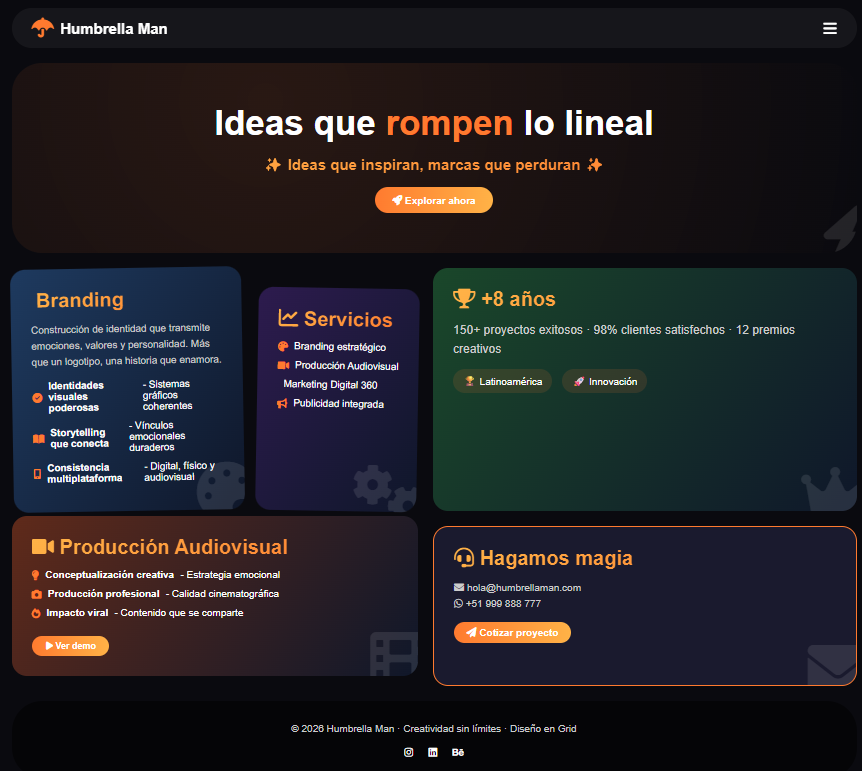

🌂 Humbrella Man - Agencia Publicitaria 🌟

¡Bienvenido a la presentación de nuestro proyecto académico: Humbrella Man!
Una agencia publicitaria ficticia diseñada para mostrar tus ideas con estilo, innovación y un toque moderno. 🚀✨

🎯 ¿De qué se trata este proyecto?

Este proyecto corresponde a una **tarea académica** en la que se desarrolla una página web para una agencia publicitaria ficticia llamada **Humbrella Man**.  
El objetivo es aplicar conceptos de **HTML y CSS** para construir una interfaz moderna, dinámica y responsiva, inspirada en sitios reales de agencias creativas.

---

## 📌 Descripción
La página web presenta un diseño más **intuitivo y no lineal**, incorporando:
- **Header** con nombre y lema de la empresa.
- **Menú de navegación** con enlaces a secciones principales.
- **Hero section** con imagen de fondo y llamada a la acción.
- **Servicios** en formato de **cards con efectos hover**.
- **Bloques temáticos** como *Producciones Audiovisuales* y *Branding*, explicados en secciones estilizadas.
- **Sección institucional** sobre la empresa.
- **Contacto** con información básica.
- **Footer ampliado** con derechos reservados y espacio para enlaces futuros.

---

## 🚀 Cómo visualizar el proyecto
1. Clona o descarga este repositorio.
2. Abre el archivo `index.html` en tu navegador (Chrome, Edge, Firefox).
3. Alternativamente, abre el proyecto en **Visual Studio Code** y utiliza la extensión **Live Server** para ver los cambios en tiempo real.

---

## 🛠️ Tecnologías utilizadas
- **HTML5** para la estructura.
- **CSS3** para estilos modernos y diseño responsivo.
- Tipografía **Poppins** desde Google Fonts.
- Paleta de colores oscuros con acentos en naranja (#ff9800).
- Diseño modular con **grid y cards** para evitar linealidad.

---

## 🎯 Objetivo académico
Este proyecto busca demostrar:
- Uso correcto de etiquetas semánticas en HTML.
- Aplicación de estilos modernos con CSS.
- Organización modular y dinámica de secciones.
- Creatividad en la presentación de contenidos publicitarios.
- Implementación de un diseño más atractivo y menos lineal.

---

## 📄 Nota
Este sitio web es parte de una **tarea académica** y no corresponde a una agencia real.  
Se creó con fines de práctica y aprendizaje en desarrollo web.
